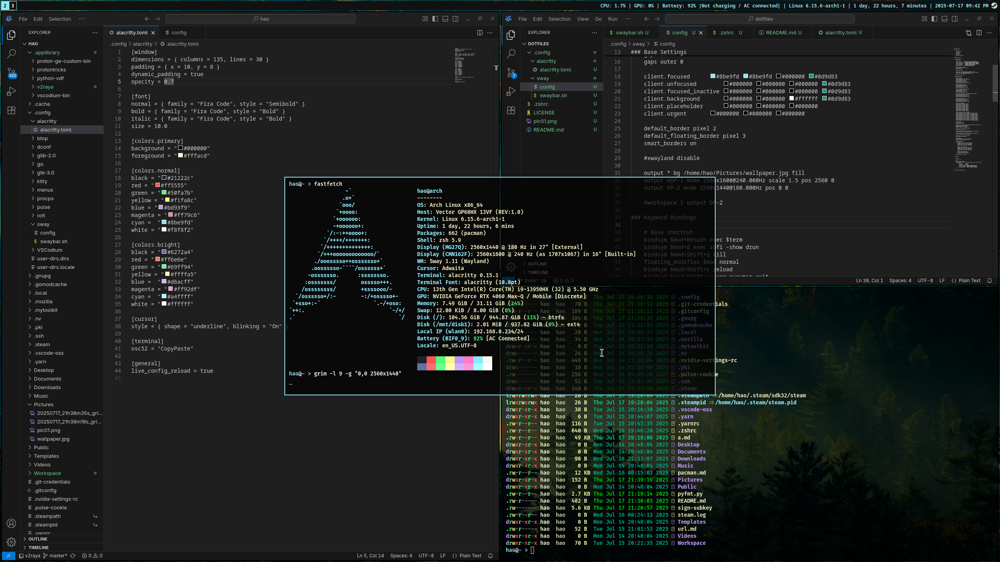

# Dotfiles

This is my personal dotfiles repository, which only contains some configurations and simple scripts.

### My Devices:

- MSI GP 68HX 13VF (Laptop)
- Dell OptiPlex 3060MFF (Intranet server)

### Files List：

 - SwayWM : : *`~/.config/sway/*`*
 - Alacritty : : *`~/.config/alacritty/*`*
 - Zsh : : *`~/.zsh*`*

### Screenshot：

Laptop

Server

